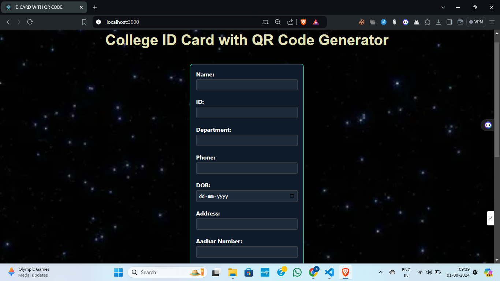
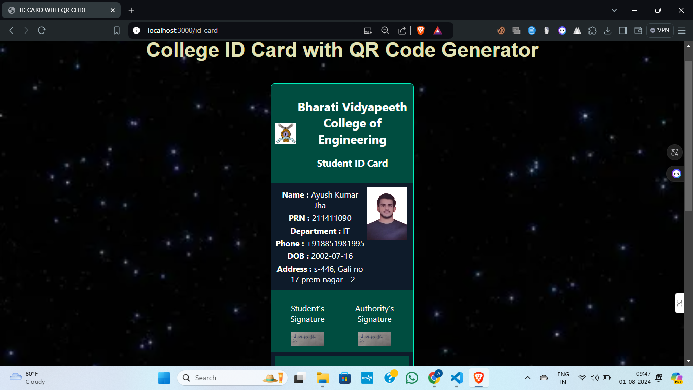

# College ID Card with QR Code Generator

## Overview

This project is a web-based application developed using React JS for generating customizable college ID cards with embedded QR codes. It’s designed for students, allowing the creation of ID cards with essential information such as name, student ID, department, phone number, Aadhar number, date of birth (DOB), address, and more.

## Features

- **Customizable ID Cards**: Input and display personal details.
- **Embedded QR Codes**: QR codes are generated and included in the ID card for easy verification and access.
- **Professional Design**: Styled to present information clearly and professionally.

## Live Demo
You can check out the live demo of the project here: <a href="https://id-card-with-qr-code-generator.vercel.app/" target="_blank">Live Demo</a>

## Usage

1. **Enter Details**: Fill in the form fields with the required information including name, student ID, department, phone number, Aadhar number, DOB, and address.
2. **Generate QR Code**: Click the button to generate the QR code and view the ID card.
3. **Download/Print**: The generated ID card can be downloaded or printed for use.

## Screenshots

### Homepage

The homepage where users can enter their details to generate the ID card.

### ID Card Preview

A preview of the generated ID card with the embedded QR code.

### Download Page

The page where users can download or print the generated ID card.

## Technologies Used

- **React JS**: Front-end framework for building the user interface.
- **QR Code Generator Library**: Used to create QR codes (e.g., `qrcode.react`).

## Contact

For any questions or feedback, please reach out to [ayushjha298@gmail.com](mailto:ayushjha298@gmail.com).
